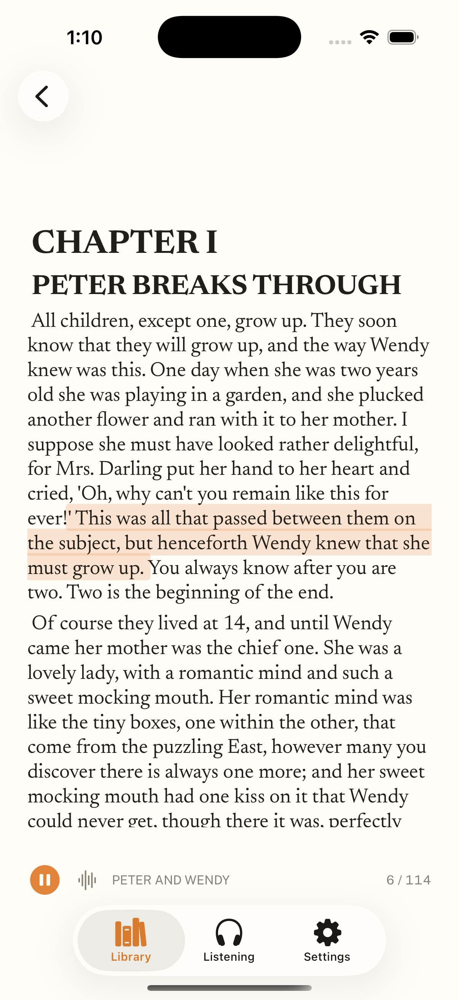

# Issa Reader

A native Apple client suite for [Storyteller](https://gitlab.com/storyteller-platform/storyteller):
ebooks, audiobooks, and synchronised readalong, on iPhone, Apple TV and the Mac.

Written in Swift 6 for iOS 26, macOS 26 and tvOS 26. No code is taken from
Storyteller's own clients; only the server's HTTP contract, which is public API.



## Why it exists

The official mobile client is React Native. It is slow, has no home-screen
widgets and no CarPlay, and there is no Mac or Apple TV app at all. Every
architectural choice here is made to beat it on cold launch, scroll, page-turn
and highlight-sync latency.

## What works today

| | |
| --- | --- |
| Sign-in | Device authorization grant (RFC 8628) through the server's own OIDC provider — verified end to end against Keycloak on iPhone and Apple TV |
| Library | Whole catalogue in one fetch, cached locally; instant search, and every shelf and Explore rail derived on device |
| Reader | Native TextKit 2 pagination, bundled Newsreader, four page themes, adjustable size and leading |
| Readalong | SMIL media overlays parsed into a book timeline; the highlight tracks real narration with exact glyph rectangles and turns pages to follow it |
| Playback | Variable rate with pitch correction, chapter and sentence navigation, Now Playing on the lock screen |
| Controls | Every external control remappable per surface — phone, CarPlay, headphones — including a car's steering-wheel buttons |
| Apple TV | Device-code sign-in, poster-shelf library, one-sentence-at-a-time readalong |
| Mac | Sidebar library, each book in its own window |
| Widget | Current book, chapter and progress from a shared App Group snapshot |

`docs/VERIFICATION.md` records exactly what has been run, and what has not.

## Layout

```
Packages/
  IssaCore      models, networking, auth, sync, downloads
  IssaEPUB      EPUB container and package parsing, SMIL media overlays
  IssaRender    XHTML to styled text, TextKit 2 pagination, highlight geometry
  IssaPlayback  audio engine, readalong coordinator, control remapping
  IssaUI        design tokens, type ramp, bundled fonts
Apps/
  IssaReader-iOS      iPhone and iPad, plus the CarPlay scene
  IssaReader-macOS    native Mac app
  IssaReader-tvOS     Apple TV
  IssaWidgets         WidgetKit extension
  Shared              views and app model used by more than one platform
Tools/
  docker    local Storyteller + Keycloak stack and its provisioning scripts
  scripts   fixture generation
```

The Xcode project is generated: edit `project.yml`, then `xcodegen generate`.
It is not committed.

## Getting started

```bash
brew install xcodegen
xcodegen generate

cd Tools/docker
npm install
PUBLIC_HOST=$(ipconfig getifaddr en0) node setup.mjs
```

`setup.mjs` brings up Storyteller `web-v2.14.21` and Keycloak, creates an admin
account, wires Keycloak in as an OIDC provider with group-derived permissions,
and smoke-tests the endpoints the client depends on. It is idempotent.

Everything must agree on **one host**. Auth.js sets the PKCE `state` cookie on
the origin that begins the OIDC redirect and reads it back on the callback, so
mixing `localhost` with the LAN address fails with "state value could not be
parsed" — and the LAN address is the only one a phone or Apple TV can reach.

Then run any scheme from Xcode, or:

```bash
swift test                                    # 67 tests, no server needed
node Tools/docker/verify-device-flow.mjs      # full sign-in round trip
```

## Notes on the server

Storyteller is pinned to `web-v2.14.21`, the latest stable tag; `:latest` tracks
the 3.0.0 experimental line. The client targets 2.14.21 as its baseline and
probes for the ~48 endpoints 3.x adds, lighting them up when present. Settings
shows which its server provides.

On 2.14.21 `GET /api/v2/books` takes no query parameters and returns the entire
library in one array — including this user's reading position and status. That
is a trap for a naive client and an opportunity for this one: the catalogue is
ingested once and all searching, filtering and shelf-building happens locally,
which is faster than round-tripping and works offline.

A handful of the server's sharper edges, each verified against a running
instance, are documented where the code has to handle them — three different
date formats in one JSON object, `expires_in` computed as `epochMillis * 1000`,
`slow_down` used as a plain rate limiter rather than RFC 8628's backoff signal,
and a readaloud that reports `ALIGNED` while carrying no media overlays at all.

## Fonts

Newsreader and Public Sans, both under the SIL Open Font License 1.1. See
`Packages/IssaUI/Sources/IssaUI/Resources/Fonts/OFL.txt`.
